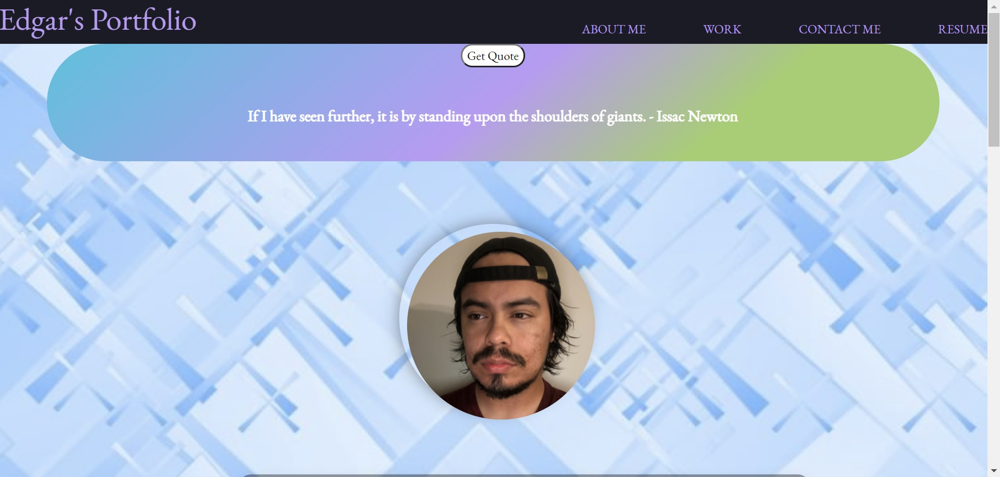
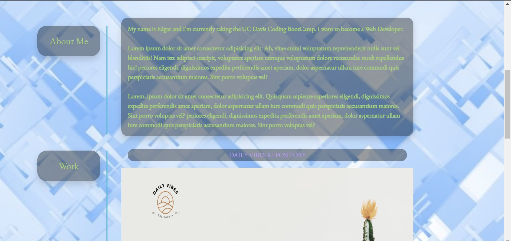
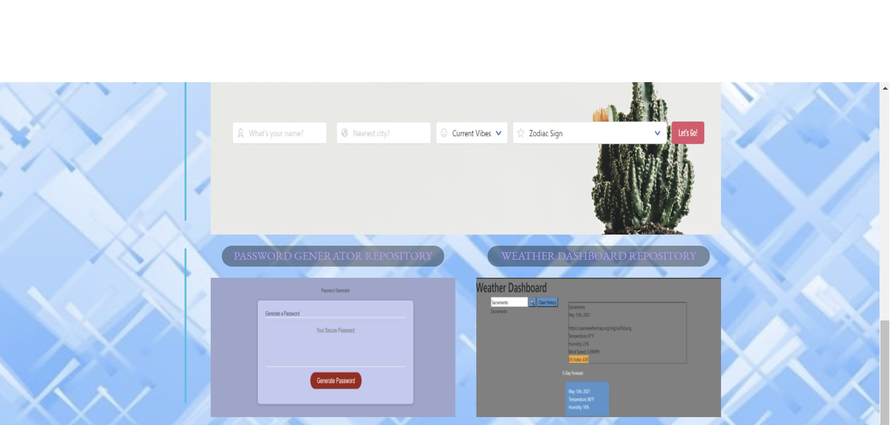
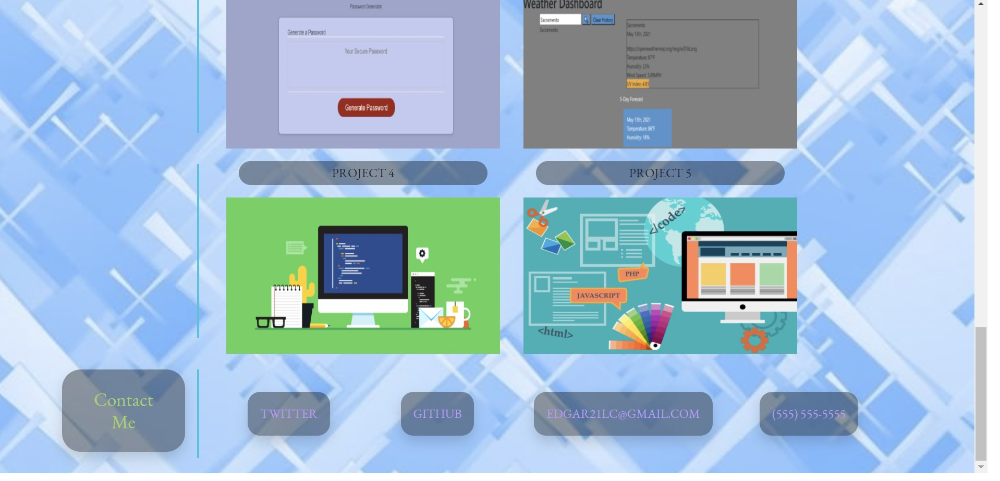

#Description
Updated my Portfolio page.

<!-- HTML -->

Added a picture of myself.
Added Bootstrap and Jquery links to HTML
Added bootstrap colummns to separate all the sections.
Added Project 1 which is called Daily Vibes to webpage, also added two of the homeworks.
Added links to Project/Homework assignemnt page and links to the repos.

<!-- CSS -->

Adjusted the CSS to fit this page better.

<!-- Javascript -->

Added a get quote button using Jquery that when clicked will pull a random quote from a premade array and it will display it on the webpage. The quotes are from hearing them in school or from podcasts that've I've listened to.
Used the imgur API to get images from a premade album on imgur and used those images to randomly generate a new background every time the page is refreshed.

https://edgarl21.github.io/Portfolio/
